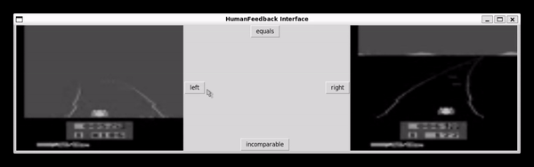
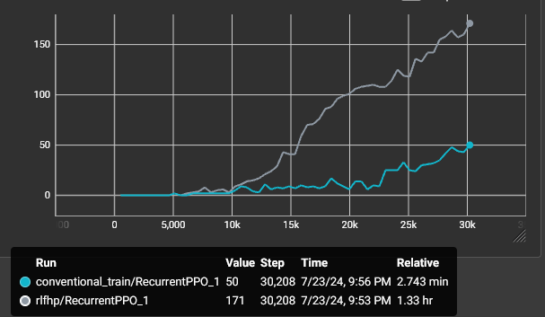
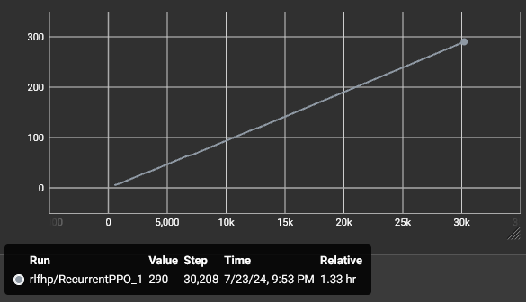
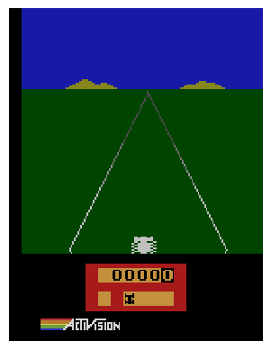
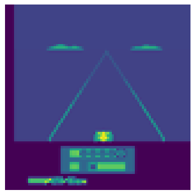

# deep-learning-from-human-preferences

## Summary

- [deep-learning-from-human-preferences](#deep-learning-from-human-preferences)
  - [Summary](#summary)
  - [Project](#project)
    - [Example of human feedback](#example-of-human-feedback)
    - [Benchmark](#benchmark)
    - [How it works](#how-it-works)
      - [Frame gather from Gymnasium API](#frame-gather-from-gymnasium-api)
      - [Rewards](#rewards)
      - [Reward Model](#reward-model)
      - [Training policy $\pi$](#training-policy-pi)
  - [References](#references)

## Project

&nbsp;&nbsp;&nbsp;&nbsp;The paper "Deep Learning from Human Preferences" by Christiano et al. (2017) explores the concept of training machine learning models using human feedback to achieve more aligned and desirable outcomes. The authors introduce a framework where deep reinforcement learning models are trained not just on predefined reward signals, but also on human evaluations of the model's performance. This approach allows the model to learn complex behaviors that are more closely aligned with human values and preferences, leading to more nuanced and effective decision-making in various tasks.

### Example of human feedback

&nbsp;&nbsp;&nbsp;&nbsp;Select preferable segment or indicate if they are incomparable.

    
    

        Human feedback interface.
    

### Benchmark

&nbsp;&nbsp;&nbsp;&nbsp;To validate the implementation, a benchmark was created. The following results are using a gymnasium env on Enduro game from Atari.

    
    

        Accumulative rewards , a benchmark was created during training on Enduro from Atari.
    

&nbsp;&nbsp;&nbsp;&nbsp;The model can be improved by optimizing the hparams and collecting more human feedbacks. Note that, since humans  must provide theirs feedbacks to the machine, the training process is consederably slow in terms of time.

&nbsp;&nbsp;&nbsp;&nbsp;During the training process, only 290 feedbacks (preference between segments) were given. On original papers, they collected 5.5k feedbacks.

    
    

        Gathered human feedbacks count during train.
    

### How it works

&nbsp;&nbsp;&nbsp;&nbsp;The following presents the steps of the training process:

#### Frame gather from Gymnasium API

&nbsp;&nbsp;&nbsp;&nbsp;The current DLFHP implementation uses Gymnasium, which is a fork of OpenAI’s Gym library. "OpenAI Gym is a toolkit for reinforcement learning research. It includes a growing collection of benchmark problems that expose a common interface, and a website where people can share their results
and compare the performance of algorithms. This whitepaper discusses the components of OpenAI Gym
and the design decisions that went into the software" (Brockman et al., 2016).

&nbsp;&nbsp;&nbsp;&nbsp;An agent (policy $\pi$) interacts with env from Gymnasium API gathering an observation. From that observation ,the agents takes an action and, based on that action, receives a reward and a new observation.

    
    

        Observation gathered from Enduro environment.
    

&nbsp;&nbsp;&nbsp;&nbsp;To simplify the observation for the CNN model and improve learning speed, the observation is preprocessed to grayscale, resized to (80,80), and normalized between range [0, 1] by dividing each pixel by 255.

    
    

        Rescaled grayscale observation.
    

&nbsp;&nbsp;&nbsp;&nbsp;These observations are feed to a policy $\pi$ that will be trained using Reinforcement Learning, with rewards serving as feedback on how good the actions were. The policy $\pi$ is feed with sequences of $n$ observations.

#### Rewards

&nbsp;&nbsp;&nbsp;&nbsp;The Gymnasium API already provides rewards for each step an policy $\pi$ takes on it envs, but we will modify it to use our Reward Model that predicts rewards for each timestep. This model will be feed with the same observation that our policy $\pi:o \rightarrow a$ receives, and the action $a$ taken by the $\pi$ on that same observation will be feed together into the Reward Model. The policy $\pi$ is trained using the rewards gathered from the Reward Model.

&nbsp;&nbsp;&nbsp;&nbsp;The rewards given by the Gymnasium API will be used to compare two agents: one trained using the the Reward Model and another trained using the true rewards (from Gymnasium API). While training the model trained using feedbacks will never use the true rewards.

#### Reward Model

&nbsp;&nbsp;&nbsp;&nbsp;Training a policy $\pi$ using human feedback is a complex task that can be challenging for many complex environments. The paper "Deep Learning from Human Preferences" by Christiano et al. (2017) aims to solve that problem. "We show that this approach can effectively solve complex RL tasks without access to the reward function, including Atari games and simulated robot locomotion, while providing feedback on less than 1% of our agent’s interactions with the environment"(Christiano et al., 2017).

&nbsp;&nbsp;&nbsp;&nbsp;TTo predict rewards, the model needs both an observation $o_t$ and an action $a_t$ that the policy $\pi$ takes $o_t$, so it can predict the reward $r_t=\hat{r}(o_t, a_t)$.

&nbsp;&nbsp;&nbsp;&nbsp;Adjusting the reward function $\hat{r}$ can be done using human preferences. The preferences are based on segments $\sigma = ((o_0, a_0), (o_1, a_1), ..., (o_{k-1}, a_{k-1}))$. Humans must select a segment they prefer over another segment $\sigma^1 \succ \sigma^2$ or indicate if they are incomparable. Preferences of segments $\sigma$ are stored on a tuple $D$ as tuple $(\sigma^1, \sigma^2, \mu)$, the $\mu$ is a distribution of segments $\sigma$ preference. A cross-entropy loss can train the model to predict the probabilities to predict the probabilities of these preferences $\hat{P}[\sigma^1 \succ \sigma^2]$ and using $\mu$ as labels.

#### Training policy $\pi$

&nbsp;&nbsp;&nbsp;&nbsp;Using the preprocessed observation $o_t$, the policy $\pi$ takes an action $a_t$, receiving an $\hat{r}_t$ and a new observation $o$ for $k$ timesteps. These experiences are stored in a tuple $T=(\sigma^{0},\sigma^{1},..., \sigma^{k-1})$. After $k$ timesteps, the policy $\pi$ is updated using PPO method (Schulman et al, 2017) based on predicted rewards $r$ from Reward Model $\hat{r}$. Humans then select their preferences between randomly sampled segments $\sigma$ from the tuple $T$ and store theses preferences  $\sigma^1 \succ \sigma^2$ on the tuple $D$ so that the Reward Model $\hat{r}$ can be updated. This process continues until the specified number of timesteps $k=30.000$ is reached.

## References
- Christiano, P. F., Leike, J., Brown, T. B., Martic, M., Legg, S., & Amodei, D. (2017). Deep reinforcement learning from human preferences. In Advances in Neural Information Processing Systems (pp. 4299-4307).
- Brockman, G., Cheung, V., Pettersson, L., Schneider, J., Schulman, J., Tang, J., & Zaremba, W. (2016). OpenAI Gym. arXiv preprint arXiv:1606.01540. Retrieved from https://arxiv.org/abs/1606.01540
- Schulman, John, et al. "Proximal Policy Optimization Algorithms." arXiv preprint arXiv:1707.06347 (2017). https://arxiv.org/abs/1707.06347